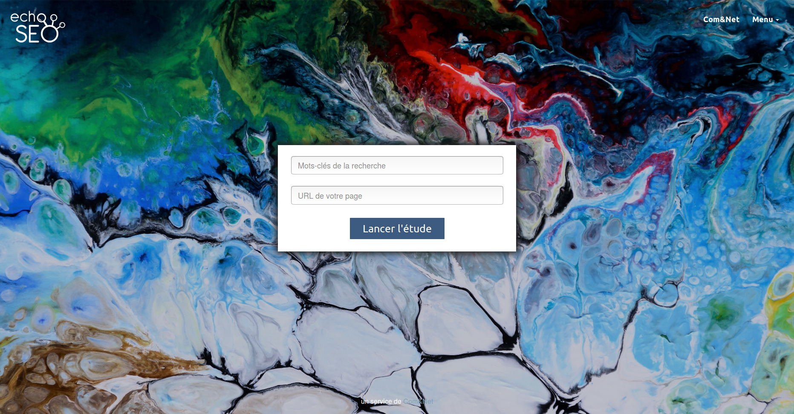
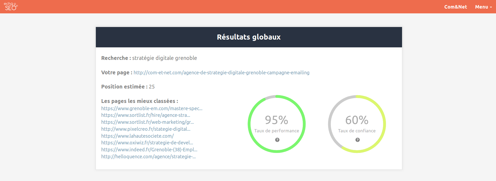
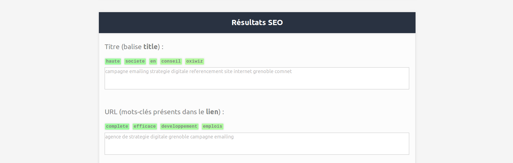
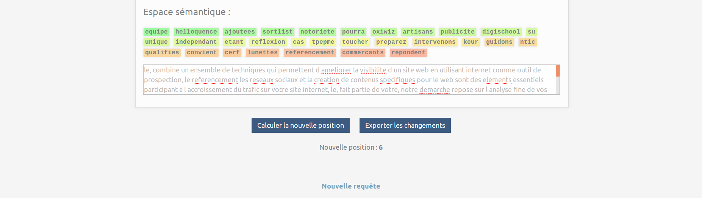

<h1 align="center">
   
  <b>SEO optimizer (full stack development)</b>
   
</h1>

<h4 align="center">A web service allowing users to optimize the SEO of their web pages</h4>
<i><h5 align="center">4th year internship</h5></i>

  
  
  

  <a href="#overview">Overview</a> •
  <a href="#report">Report</a> •
  <a href="#screenshots">Screenshots</a> •
  <a href="#credits">Credits</a> •
  <a href="#license">License</a>

  

## **Overview**

*Please note that for obvious reasons of confidentiality, not all the code is available in this repository; its own purpose is to present the work I was able to do during this project.*

During this internship, I had to set up a service to submit recommendations to a user regarding the referencing of his web page for a given request. The user therefore provides the URL of his page as well as the keywords for which he wants it to be referenced at the best and the service must send him a set of information helping him to achieve this objective.

It implied **machine learning** algorithms and a lot of different languages and frameworks such as:
- **Python** and **[Scrapy](https://scrapy.org/)**, **[Selenium](https://www.seleniumhq.org/)**
- **PHP** and **[Symfony](https://symfony.com/)**, **[Twig](https://twig.symfony.com/)**
- **HTML & CSS**
- **JavaScript** and **[jQuery](https://jquery.com/)**

## **Report**

Nothing will be further explained here; a very detailed report of this project is available [here](report/en_report.pdf).

The french version is available [here](report/fr_report.pdf).

## **Screenshots**

Here is the home page where the user needs to enter the keywords and the URL of his page:

  

And here is how the resulting web service page showing right after the process looks like:

  

  

  

## **Credits**

This project is now owned by **[Com&Net](http://com-et-net.com/)**.

  

The machine learning algorithms that have been used to provide this service were made in partnership with the **[UGA](https://www.univ-grenoble-alpes.fr/)**.

  

## **License**

© **[Julien Cordat-Auclair](https://github.com/jcordatauclair)**
